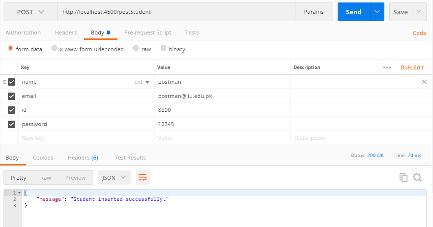
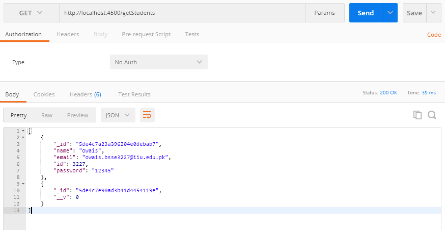
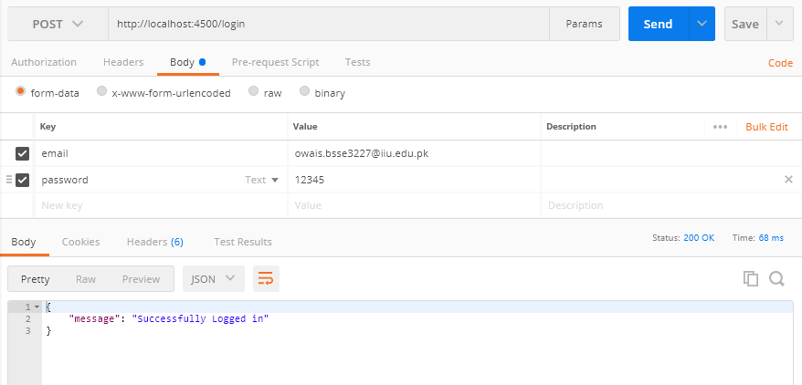

# Node API have following features.
<ul>
  <li>Create a new User.</li>
<li>Update Existing User.</li>
<li>Read  a List of users OR single user by id.</li>
<li>Delete existing user.</li>
<li>login</li>
<li>signup</li>
</ul>

Connected with online cluster of mongodb.
<ul>
  <li></li>app is deployed in heroku.</li>
  <li>API have following endpoints.</li>
</ul>
<ol>
  Home Page of API
  <li><a href = "https://crud-node-apis.herokuapp.com/">https://crud-node-apis.herokuapp.com/</a></li>
  Get method to get All users.
  <li><a href = "https://crud-node-apis.herokuapp.com/getUsers">https://crud-node-apis.herokuapp.com/getUsers</a></li>
  Get method to get user by id.
  <li><a href = "https://crud-node-apis.herokuapp.com/{id}">https://crud-node-apis.herokuapp.com/{id}</a></li>
  Patch method to Update existing user by providing id of user.
  <li><a href = "https://crud-node-apis.herokuapp.com/{id}">https://crud-node-apis.herokuapp.com/{id}</a></li>
  Dlete method to Delete existing usetr by providing the id of user.
  <li><a href = "https://crud-node-apis.herokuapp.com/{id}">https://crud-node-apis.herokuapp.com/{id}</a></li>
</ol>  

Insert new Student
 
 
 
Return list of students.
 
 
 
Login the page
 
 
 
